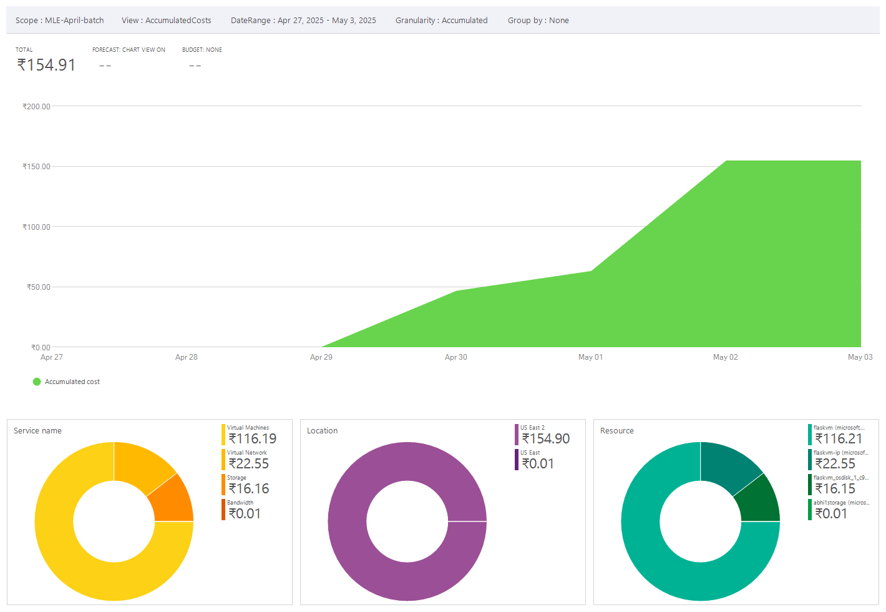

# pyspark-azure
This is repository contains the flask app, that displays the name the files present in my Azure Container. 
# Running the app on a local machine
In order to run the flask app, perform the following steps

1. Make sure you have set up the environment with all the dependencies.
2. Activate the virtual environment by typing `source azure_env/bin/activate`
3. Go to the root directory of the project, that is just outside of the app folder in the project directory.
4. Run the command `python3 app.py` run.
5. Your app should run perfectly on localhost !
# Running the app from Azure VM
In order to run the flask app from VM , perform the following steps.

1. SSH into VM `ssh azureuser@<vm_public_ip>`
2. On VM 
    ```python 
    sudo apt update && sudo apt install 
    python3-pip -y pip3 install flask azure-storage-blob
    ```
3. Transfer app via scp `scp -r /path/to/local/folder username@azure-vm-ip:/path/to/remote/destination `
4. Create inbound security rule in Azure Portal enter public IP address and give port `5000`
5. Run the command `python3 app.py` and copy the url with the public ip of yours vitrtual machine with the folder name
# Billing Summary

Below is a screenshot of the billing cost for the `MLE-April-batch` resource group:


