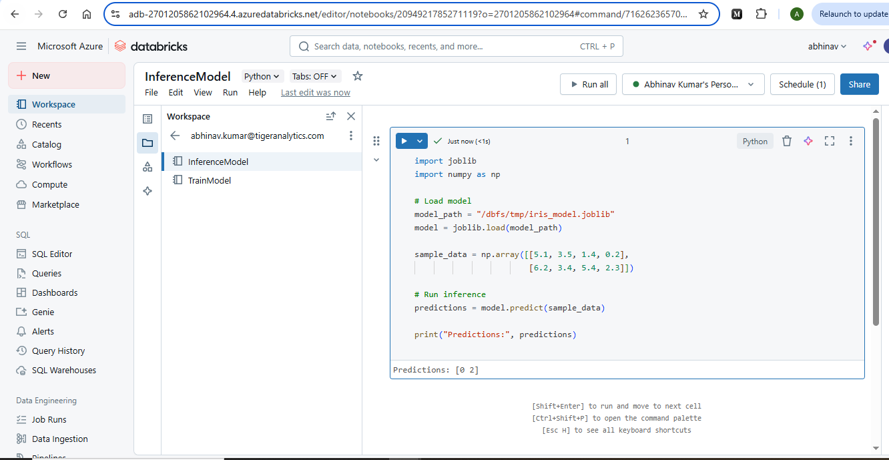
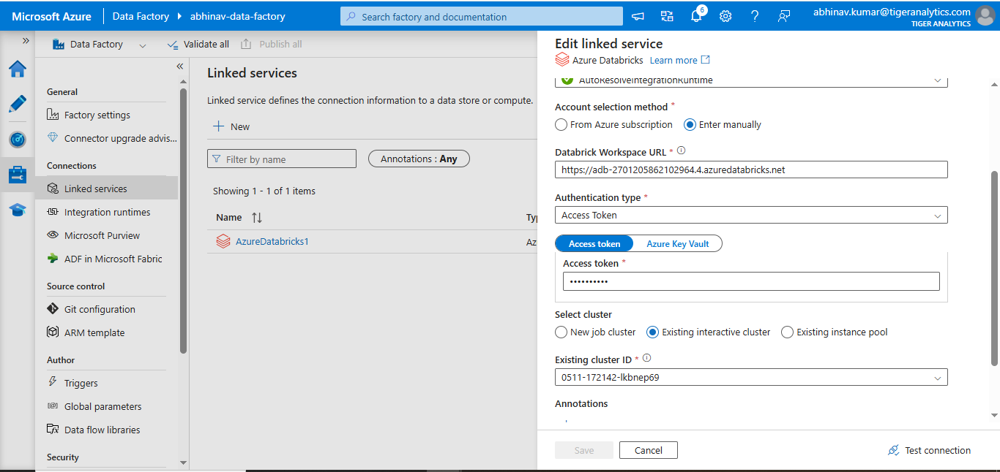
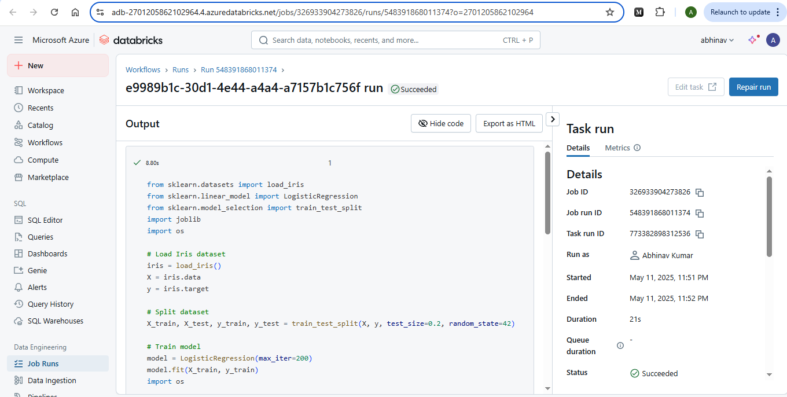
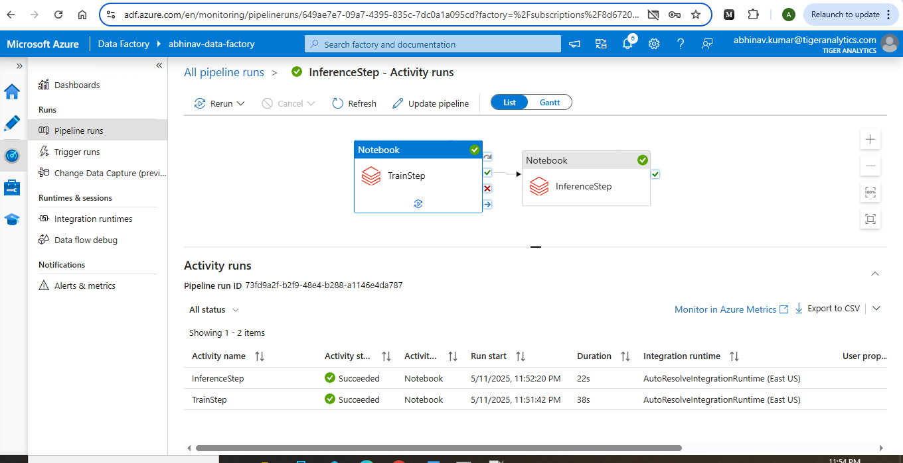

# Orchestration Pipeline
This is folder contains the orchestration pipeline for training and inference in databricks using Azure ADF.
# Steps to Build the Solution
1. Create Databricks Notebooks,we can use a built-in dataset from scikit-learn (Iris dataset), which is included by default in the Databricks Python environment.
2. open Azure Databricks resource and Create two Notebook.

    - TrainModel

    

    - InferenceModel

    

3. Create two jobs — one for training, one for inference.

4. Go to Azure Databricks Workspace, In the left sidebar, click Jobs and fill all the necessary details.

5. Set Up Azure Data Factory

6. Create Linked Service to Azure Databricks
    - In ADF Studio, click the Manage (🔧 gear icon) in the left menu
    - Go to Linked services → New
    - In the search box, type Databricks
    - Select Azure Databricks → Continue

    

7. Create Pipeline with Two Activities
    - Go to Author → Pipelines → New Pipeline.
    - Add two Databricks Notebook activities.
    - First: TrainModel notebook
    - Second: Inference notebook
    - Link them: output of TrainModel flows into Inference.

8. Trigger and Monitor
    - Click “Add Trigger” → “Now” (manual run).

    

    - Now check the pipeline .

    

